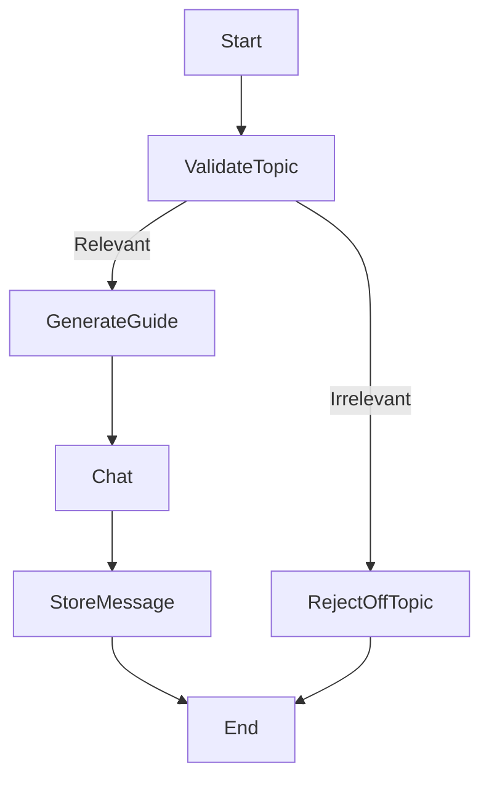

# 🧠 KodeKloud AI Chatbot - Backend

This is the FastAPI + LangGraph + LangChain-powered backend for the KodeKloud AI chat assistant.

It retrieves guides, validates user questions for topic relevance, and uses OpenAI models with vector search over domain-specific content.

---

## 🔧 Architecture Overview

```
FastAPI
├── /api/main.py         ← API endpoints (chat, guide, history)
├── /chatflow/           ← LangGraph nodes & flow orchestration
│   ├── nodes/
│   │   ├── start_node.py
│   │   ├── validate_topic.py
│   │   ├── reject_off_topic.py
│   │   ├── generate_guide.py
│   │   ├── chat.py
│   │   └── store_message.py
│   └── flow.py
├── /db/                 ← MongoDB helpers
├── /rag/neo4j_loader.py← Topic embeddings via Neo4j Aura
└── /utils/embeddings.py← Embedding + cosine similarity logic
```

---

## 🚀 How to Run Locally

### 🔧 Prerequisites

- Python 3.12
- `virtualenv` or `venv`
- `MongoDB` running locally or in the cloud (Atlas)
- `Neo4j AuraDB` with topic embedding data

### 🛠️ Setup

```bash
# Clone repo
git clone https://github.com/TharunBejawada/kodekloud-chat-backend.git
cd kodekloud-chat-backend

# Create virtual environment
python3.12 -m venv venv
source venv/bin/activate

# Install dependencies
pip install -r requirements.txt

# Set environment variables
cp .env.example .env
# then fill in:
# OPENAI_API_KEY=
# MONGODB_URI=
# NEO4J_URI=
# NEO4J_USER=
# NEO4J_PASSWORD=

# Run FastAPI
uvicorn api.main:app --reload
```

Backend runs on: `http://localhost:8000`

---

## 🔄 Chat Flow (LangGraph)



---

## 🧠 Models & Tools Used

- `LangChain`
- `LangGraph`
- `OpenAI Embeddings + Chat Models`
- `FAISS` vectorstore
- `Neo4j` for topic knowledge graph
- `MongoDB` for chat history

---

## 🔐 Env Config (`.env`)

```
OPENAI_API_KEY=
MONGODB_URI=
NEO4J_URI=
NEO4J_USER=
NEO4J_PASSWORD=
```

---

## 📬 API Endpoints

| Method | Endpoint          | Description                 |
|--------|-------------------|-----------------------------|
| GET    | /chat-history     | Get messages by user/topic  |
| GET    | /guide-history    | Load guide from MongoDB     |
| POST   | /generate-guide   | Create guide (from Neo4j)   |
| POST   | /chat             | Full chat flow orchestration|

---

## 🧑‍💻 Author

Tharun Bejawada
